# VideoAgent — 视频理解与智能问答（基于 AX650N）

**长视频智能理解** | **多模态检索增强生成（RAG）** | **AX650N 边缘 AI 部署**

<p align="center">
  
  
  
</p>

---

基于 AX650N 芯片平台构建的多模态 VideoAgent，融合 **ASR 语音识别 + VLM 视觉描述 + 多模态向量检索 + LLM 问答**，面向长视频的智能索引、跨模态检索与自然语言问答。专为 **AX650N 边缘 AI 芯片**优化，可在边缘设备上实现完整的视频理解与智能问答。

---

## 目录

- [项目背景](#项目背景)
- [核心特性](#核心特性)
- [系统架构](#系统架构)
- [快速开始](#快速开始)
- [使用方式](#使用方式)
- [案例演示](#案例演示)
- [硬件资源使用](#硬件资源使用)
- [常见问题](#常见问题)
- [参考项目](#参考项目)

---

## 项目背景

### 为什么需要视频智能问答？

视频是信息密度最高的媒介之一，但也最难被检索利用。一段长视频里同时承载着**画面内容、语音信息、时间脉络**，传统方式难以精准定位其中的关键片段。

现实痛点：

- **信息埋没** — 长视频、会议录像、监控录像时长动辄数小时，人工翻看效率极低，关键信息难以快速定位。
- **模态割裂** — 画面里"看到什么"与语音里"说了什么"被分开处理，无法统一理解与检索。
- **语义鸿沟** — 关键词匹配无法理解"有人摔倒"与画面中跌倒动作之间的语义关联，跨模态检索难以实现。
- **隐私与延迟** — 云端多模态服务需上传视频，存在隐私泄露风险与网络延迟，不适合敏感场景。

### 本项目的解决思路

本项目将视频切分为片段，对每个片段同时提取**语音文字（ASR）**与**视觉描述（VLM）**，融合后编码进统一的多模态向量空间，实现真正的跨模态语义检索；再由大语言模型（LLM）基于检索到的多模态上下文生成回答。全部模型运行在 AX650N 边缘芯片上，整条 RAG 管线本地执行：

- 🔒 **数据不出设备** — 解析、向量化、推理全部本地完成，杜绝隐私泄露风险。
- 💰 **零调用成本** — 一次硬件投入，无限次使用，适合长视频批量处理。
- 🧠 **语义级理解** — 向量检索理解语义，从画面与语音中召回相关片段，而非简单关键词匹配。

### 技术路线选型

| 环节 | 选型 | 考量 |
|------|------|------|
| 语音识别（ASR） | SenseVoiceSmall | 多语言语音理解，提取视频语音转文字 |
| 视觉描述（VLM） | Qwen3-VL-2B-Instruct | 为视频片段生成画面描述，补齐视觉语义 |
| 多模态嵌入 | Qwen3-VL-Embedding-2B | 视觉+文本统一嵌入空间，2048 维，支持片段特征检索 |
| 大语言模型（LLM） | Qwen3-1.7B | 小参数量、推理扎实，负责关键词抽取与答案生成 |
| 向量数据库 | NanoVectorDB | 轻量持久化存储，文本与视频片段特征分库管理 |
| 推理框架 | axllm（Embedding / VLM / LLM） | OpenAI 兼容 API，统一调用接口 |
| 硬件平台 | AX650N NPU | 高能效 NPU 端侧运行全部模型 |

### 应用场景

| 领域 | 典型场景 | 核心价值 |
|------|---------|---------|
| 🏢 **会议与办公** | 会议录像检索、培训视频问答 | 快速定位"谁在何时说了什么"，无需逐段回看 |
| 🎬 **媒体与影视** | 素材资产管理、镜头检索 | 用自然语言描述快速定位所需片段 |
| 🛡️ **安防与监控** | 监控录像事件定位 | 文字描述快速召回异常事件发生的时间段 |
| 🎓 **教育与科研** | 教学视频问答、课程资源检索 | 按知识点跨视频检索，辅助学习与整理 |
| 📱 **内容与直播** | 短视频/直播内容分析 | 理解视频内容，支持内容审核与二次创作 |

---

## 核心特性

### 🚀 功能特性

- **视频智能索引** — 自动分段、语音识别、画面描述、多模态信息融合，一键完成长视频入库。
- **跨模态语义检索** — 融合文本块检索与视频片段特征检索，从"说了什么"和"看到什么"双路召回。
- **自然语言问答** — 用自然语言提问，基于检索到的多模态上下文生成带时间定位的回答。
- **增量入库** — 自动跳过已索引视频，避免重复处理。
- **可配置预处理** — 分段时长、抽帧数、分辨率、帧率、检索 Top-K、相似度阈值均可通过 `.env` 调整。

### 🔧 技术特性

- **端侧全栈部署** — ASR / VLM / LLM / Embedding 全部模型基于 AX650N 芯片部署，端到端本地运行。
- **模块化解耦** — 模型客户端、视频处理、向量存储、查询编排各层独立，可替换、可扩展。
- **OpenAI 兼容 API** — Embedding、VLM、LLM 均通过标准 `/v1` 接口调用，统一接入。
- **流式输出** — 问答支持流式返回，交互体验更流畅。

---

## 系统架构

### 技术路线

#### 视频索引流程

视频经预处理、分段后**分两路并行**，均由 **Qwen3-VL-Embedding** 编码后存入 NanoVectorDB：**文本路**（ASR + VLM 融合 → 文本分块 → `chunks` 库）与**视觉路**（抽帧 → 视觉特征 → `video_segment_feature` 库）。

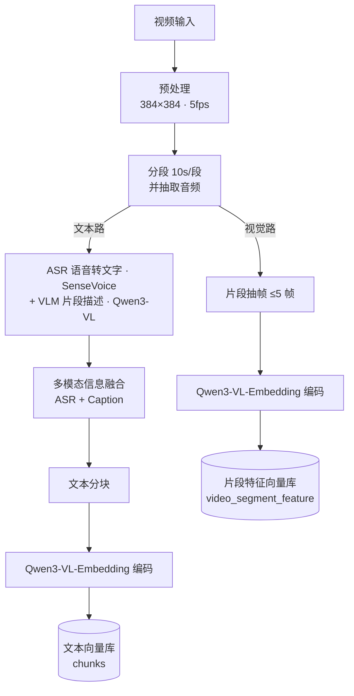

#### 查询流程

自然语言提问后**双路检索**（文本块 + 跨模态片段），由 LLM 抽取关键词、VLM 为检索片段生成相关描述，最终组装上下文交由 LLM 生成回答。

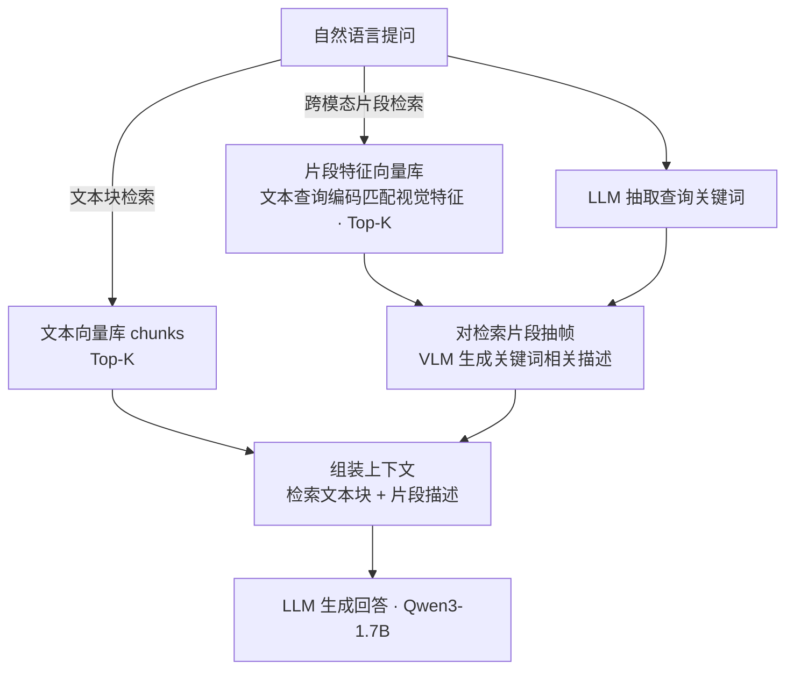


### 项目目录

```
VideoAgent-AX650N/
├── VideoAgent/                      # 核心包
│   ├── _llm/                        # 模型客户端层（OpenAI 兼容封装）
│   │   ├── embedding_model.py       # 多模态嵌入客户端
│   │   ├── vlm_model.py             # 视觉语言模型客户端
│   │   ├── llm_model.py             # 大语言模型客户端
│   │   ├── asr_model.py             # 语音识别客户端
│   │   └── tokenizer_model.py       # 分词器客户端
│   ├── _server/                     # 模型服务层（FastAPI）
│   │   ├── embedding_server.py      # Embedding 服务
│   │   ├── vlm_server.py            # VLM 服务
│   │   ├── llm_server.py            # LLM 服务
│   │   ├── sherpa_asr_server.py     # ASR 服务（SenseVoice）
│   │   └── tokenizer_server.py      # Tokenizer 服务
│   ├── _storage/                    # 存储层
│   │   ├── kv_json.py               # JSON KV 存储
│   │   └── vdb_nanovectordb.py      # NanoVectorDB 向量存储
│   ├── _videoutil/                  # 视频处理工具
│   │   ├── split.py                 # 视频预处理 / 分段 / 抽帧
│   │   ├── asr.py                   # 语音转文字
│   │   ├── caption.py               # 片段描述生成
│   │   └── feature.py               # 特征编码
│   ├── vidrag_pipeline.py           # 核心管道（VideoRAG）
│   ├── query.py                     # 查询编排
│   ├── chunk.py                     # 分块逻辑
│   ├── prompt.py                    # 提示词模板
│   └── base.py                      # 基础数据结构（QueryParam 等）
├── working_dir/                     # 运行时数据目录（索引缓存）
├── webui.py                         # Gradio Web 入口
├── videorag_longervideos.py         # 测试 / 示例脚本
├── requirements.txt                 # Python 依赖
├── .env.example                     # 环境变量模板
└── README.md                        # 项目文档
```
---

## 快速开始

### 1. 模型下载

运行前，请下载以下适配 AX650N 芯片的模型并参照相关文档完成部署：

| 模型类型 | 模型名称（链接） | 说明 |
|---------|---------|------|
| **ASR** | [SenseVoiceSmall-axmodel](https://huggingface.co/M5Stack/SenseVoiceSmall-axmodel) | 多语言语音理解模型 |
| **VLM** | [Qwen3-VL-2B-Instruct-GPTQ-Int4](https://huggingface.co/AXERA-TECH/Qwen3-VL-2B-Instruct-GPTQ-Int4) | 多模态视觉语言模型 |
| **LLM** | [Qwen3-1.7B](https://huggingface.co/AXERA-TECH/Qwen3-1.7B) | 大语言模型 |
| **Embedding** | [Qwen3-VL-Embedding-2B-AX650](https://huggingface.co/AXERA-TECH/Qwen3-VL-Embedding-2B-AX650-C128_P1280_CTX1407) | 多模态嵌入模型 |
| **Tokenizer** | [Qwen3-1.7B](https://modelscope.cn/models/Qwen/Qwen3-1.7B) | 分词器 |

### 2. 环境准备

```bash
# 安装系统依赖（视频/音频处理）
sudo apt install ffmpeg

# 安装 Python 依赖
pip install -r requirements.txt
```

### 3. 配置环境变量

Embedding、VLM、LLM、ASR、Tokenizer 均通过环境变量配置。其中 Embedding、VLM、LLM 兼容 OpenAI API 格式。

```bash
cp .env.example .env
# 编辑 .env，填入实际模型路径、API 地址与预处理参数
```

`.env` 关键配置项：

```ini
# Embedding API（OpenAI 格式）— 端口 8010
EMBEDDING_API_BASE_URL = "http://0.0.0.0:8010/v1/"
EMBEDDING_MODEL_NAME   = "AXERA-TECH/Qwen3-VL-Embedding-2B"

# VLM API（OpenAI 格式）— 端口 8011
VLM_API_BASE_URL = "http://0.0.0.0:8011/v1/"
VLM_MODEL_NAME   = "AXERA-TECH/Qwen3-VL-2B-Instruct"

# LLM API（OpenAI 格式）— 端口 8012
LLM_API_BASE_URL = "http://0.0.0.0:8012/v1/"
LLM_MODEL_NAME   = "AXERA-TECH/Qwen3-1.7B"

# ASR API — 端口 8013
SHERPA_ASR_URL    = "http://0.0.0.0:8013"
SHERPA_MODEL_FILE = "/root/huangjie/AXERA-TECH/SenseVoice/ax650/model-10-seconds.axmodel"

# Tokenizer API — 端口 8014
Tokenizer_MODEL_PATH   = "./VideoAgent/_llm/tokenizer_model/Qwen/Qwen3-1.7B"
Tokenizer_API_BASE_URL = "http://0.0.0.0:8014/"

# 预处理与检索参数
VIDEORAG_VIDEO_SEGMENT_LENGTH          = "10"   # 视频分段时长（秒）
VIDEORAG_ROUGH_NUM_FRAMES_PER_SEGMENT  = "5"    # 每段抽帧数
VIDEORAG_RETRIEVAL_TOPK_CHUNKS         = "2"    # 文本块检索 Top-K
VIDEORAG_SEGMENT_RETRIEVAL_TOP_K       = "2"    # 视频片段检索 Top-K
VIDEORAG_QUERY_BETTER_THAN_THRESHOLD   = "0.2"  # 相似度阈值
VIDEORAG_CHUNK_TOKEN_SIZE              = "800"  # 文本分块大小
```

### 4. 启动模型服务

基于 AX650N 芯片启动各模型服务：

```bash
# Embedding 服务 — 端口 8010
axllm serve /root/huangjie/AXERA-TECH/models--AXERA-TECH--Qwen3-VL-Embedding-2B-AX650-C128_P1280_CTX1407 --port 8010

# VLM 服务 — 端口 8011
axllm serve /root/huangjie/AXERA-TECH/Qwen3-VL-2B-Instruct-GPTQ-Int4 --port 8011

# LLM 服务 — 端口 8012
axllm serve /root/huangjie/AXERA-TECH/models--AXERA-TECH--Qwen3-1.7B --port 8012

# ASR 服务 — 端口 8013
python VideoAgent/_server/sherpa_asr_server.py

# Tokenizer 服务 — 端口 8014
python VideoAgent/_server/tokenizer_server.py
```

### 5. 启动项目

```bash
python webui.py
```

浏览器访问 **http://localhost:7869**

---

## 使用方式

### Web UI（推荐）

启动后在浏览器中完成视频索引与检索问答，支持在线预览：

| 索引界面 | 检索界面 |
|---------|---------|
| 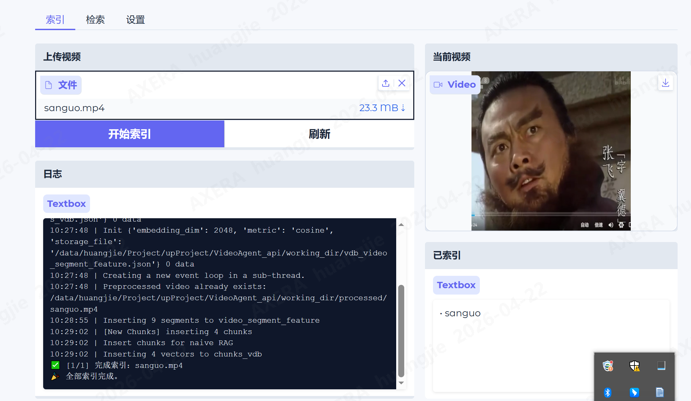 | 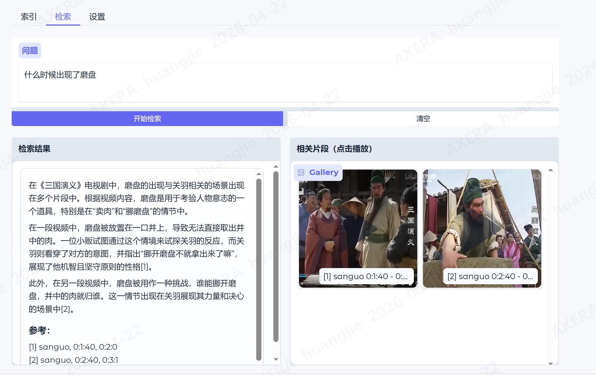 |

### Python SDK

```python
from VideoAgent import VideoRAG, QueryParam

# 初始化 RAG 系统
rag = VideoRAG(working_dir="./working_dir")

# 索引视频文件（支持批量，自动跳过已索引视频）
rag.insert_video(video_path_list=["video1.mp4", "video2.mp4"])

# 查询视频内容
result = rag.query(query="视频中什么时候出现张飞？", param=QueryParam())
print(result)
```

---

## 案例演示

检索《三国演义》视频片段中的特定内容：

<video controls src="assets/sanguo.mp4" title="三国演义示例视频"></video>

### 使用步骤

[观看演示视频](https://github.com/user-attachments/assets/41ab57cb-63b8-4692-ae52-4f51f84f0145)

**1. 在 AX650N 芯片上启动相关服务**

Embedding 服务
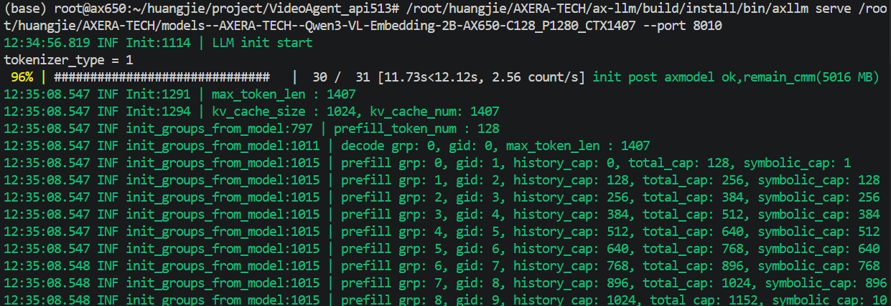
VLM 服务
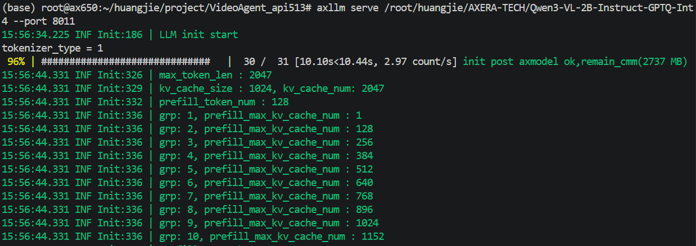
LLM 服务
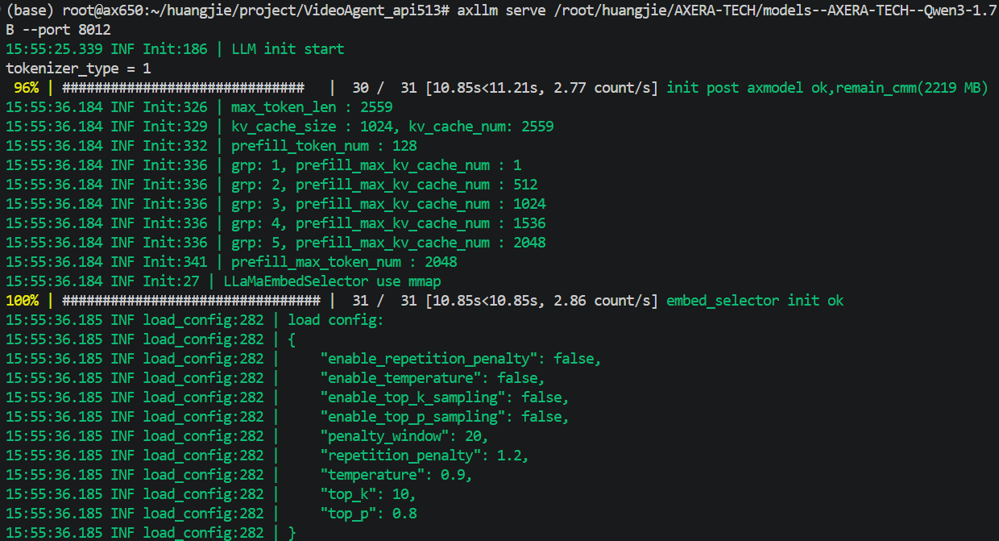
ASR 服务
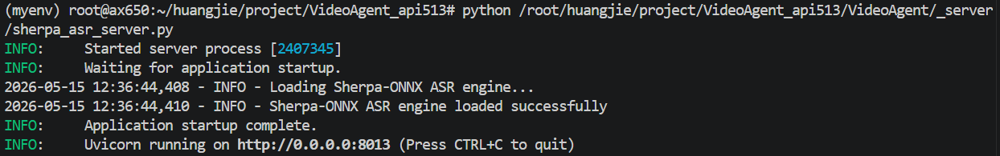
Tokenizer 服务
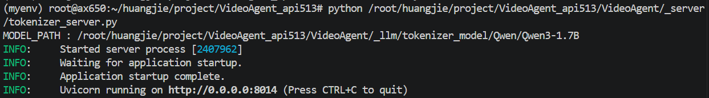
运行启动服务
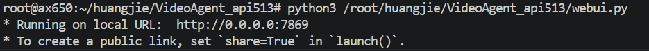

**2. 上传原始视频构建索引：**

上传需要进行索引的视频文件，支持播放正在进行索引的视频，查看已完成索引的视频列表。

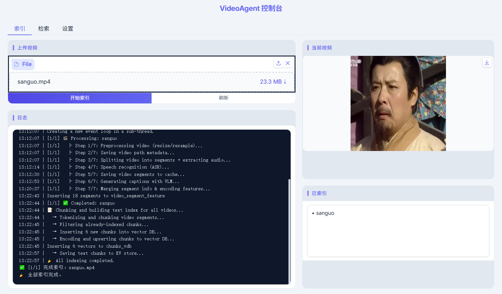

**3. 完成索引后进行内容检索：**

输入内容进行检索，根据输入内容和相关文本/视频片段生成最终回答，支持播放检索到的视频片段。

例如输入「磨盘」，检索到包含「磨盘」的视频片段：

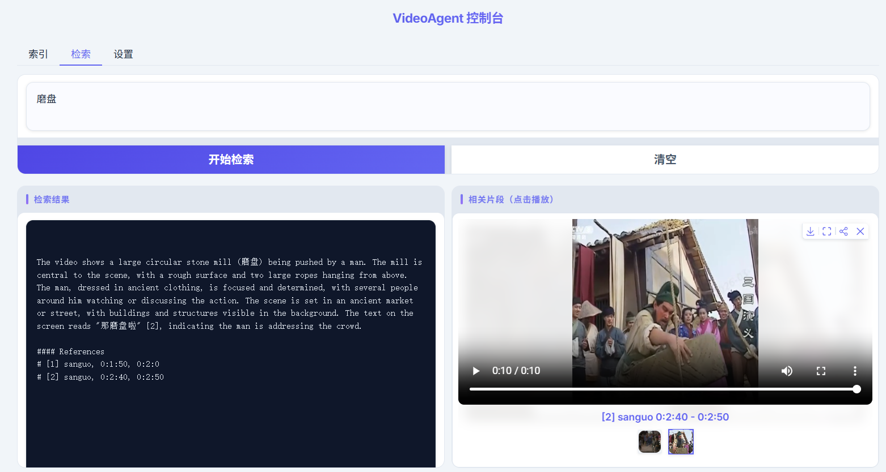

可按需设置检索的视频/文本片段数目、阈值等参数：

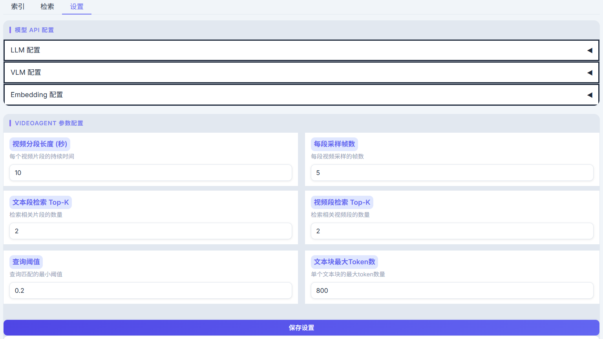

---

## 硬件资源使用

基于 AX650N 平台运行本项目时，内存（CMM）、Flash 占用情况如下：

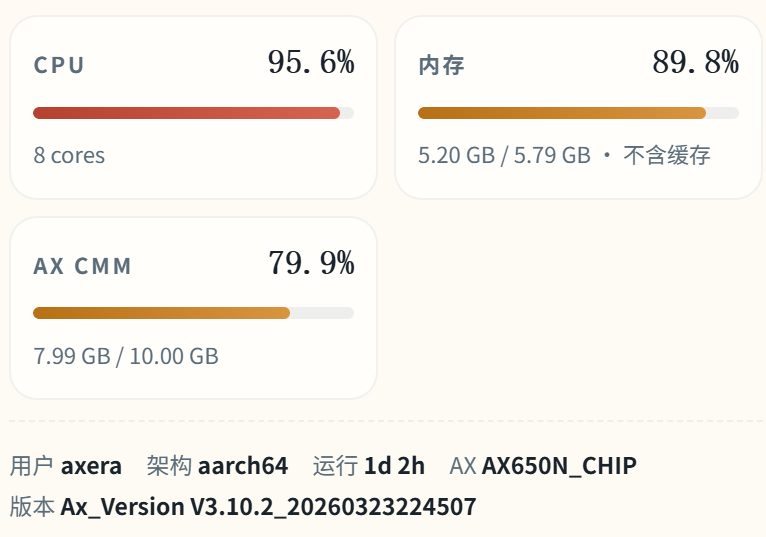

---

## 常见问题

### Q: 视频索引很慢，如何加速？

索引耗时主要来自 VLM 描述与特征编码。可在 `.env` 中适当增大 `VIDEORAG_VIDEO_SEGMENT_LENGTH`（减少片段数）、减小每段抽帧数 `VIDEORAG_ROUGH_NUM_FRAMES_PER_SEGMENT`，或降低预处理分辨率 / 帧率，以在精度与速度间取得平衡。

### Q: 检索不到相关片段？

请先确认 Embedding 服务已正常启动、视频已成功索引。若召回为空，可适当调低相似度阈值 `VIDEORAG_QUERY_BETTER_THAN_THRESHOLD`，或增大 `VIDEORAG_SEGMENT_RETRIEVAL_TOP_K` 与 `VIDEORAG_RETRIEVAL_TOPK_CHUNKS`。

### Q: 如何确认各模型服务已就绪？

各服务默认端口为 Embedding 8010、VLM 8011、LLM 8012、ASR 8013、Tokenizer 8014。可分别访问对应端口或查看服务日志确认启动成功后，再运行索引与查询。

### Q: 重复索引同一视频会怎样？

系统以视频文件名作为标识，`insert_video` 会自动跳过已索引的视频，避免重复处理。如需重新索引，请清理 `working_dir` 中对应数据。

### Q: 语音识别（ASR）报错或无字幕？

请确认已安装 `ffmpeg`，`SHERPA_MODEL_FILE` 指向正确的 axmodel 文件，且 ASR 服务已启动。无语音的视频片段仍可仅凭画面描述参与检索。

---

## 参考项目

- 香港大学数据科学实验室（HKUDS）— [VideoRAG](https://github.com/HKUDS/VideoRAG)：超长视频跨模态检索增强生成框架
